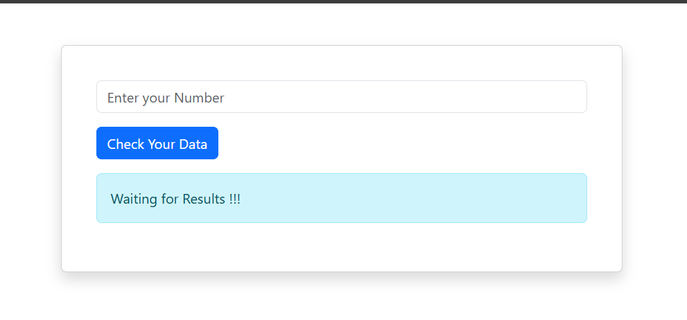

# 🔢 JavaScript Even & Odd Checker

A simple, responsive, and interactive **Even & Odd Checker** built using **HTML5, Bootstrap 5, and JavaScript**. This project allows users to enter a number and instantly determine whether it is **Even** or **Odd** through JavaScript logic.

---

## 📖 Overview

This project was created to practice the fundamentals of JavaScript, including user input handling, conditional statements, event handling, and DOM manipulation. It features a clean and responsive interface designed with Bootstrap 5.

---

## ✨ Features

- 🔢 Check whether a number is Even or Odd
- ⚡ Instant result display
- 📱 Fully responsive design
- 🎨 Clean and modern user interface
- ✅ Input validation
- 🚀 Beginner-friendly JavaScript project

---

## 🛠️ Technologies Used

- HTML5
- Bootstrap 5
- JavaScript (ES6)

---

## 📚 JavaScript Concepts Practiced

- Functions
- DOM Manipulation
- Event Handling
- `addEventListener()`
- `getElementById()`
- `value` Property
- `if...else` Statements
- Modulus (`%`) Operator
- Input Validation
- Dynamic Content Update (`innerHTML` / `textContent`)

---

## 📂 Project Structure

```
javascript-even-odd-checker/
│
├── index.html
├── script.js
├── preview.png
└── README.md
```

---

## 🚀 How to Run

1. Clone this repository

```bash
git clone https://github.com/Joni250/javascript-even-odd-checker.git
```

2. Open the project folder.

3. Run `index.html` in your preferred web browser.

---

## 📸 Project Preview

> Add your project screenshot below.

```markdown

```

---

## 🌐 Live Demo

**GitHub Pages:**

```
https://joni250.github.io/javascript-even-odd-checker/
```

*(Enable GitHub Pages from **Settings → Pages** if it is not live yet.)*

---

## 🎯 Learning Objectives

This project helped me strengthen my understanding of:

- JavaScript Fundamentals
- Conditional Logic
- DOM Manipulation
- Event Handling
- Responsive Web Design
- Bootstrap Components

---

## 💡 Future Improvements

- Keyboard Enter key support
- Dark Mode
- Number History
- Animation Effects
- Better Error Messages
- Reset Button

---

## 👩‍💻 Author

** Mst Joni Khatun**

GitHub Profile:
https://github.com/Joni250

---

## ⭐ Support

If you found this project helpful, please consider giving it a ⭐ on GitHub.

It motivates me to continue building and sharing more web development projects.

---

## 📄 License

This project is open source and available under the **MIT License**.
